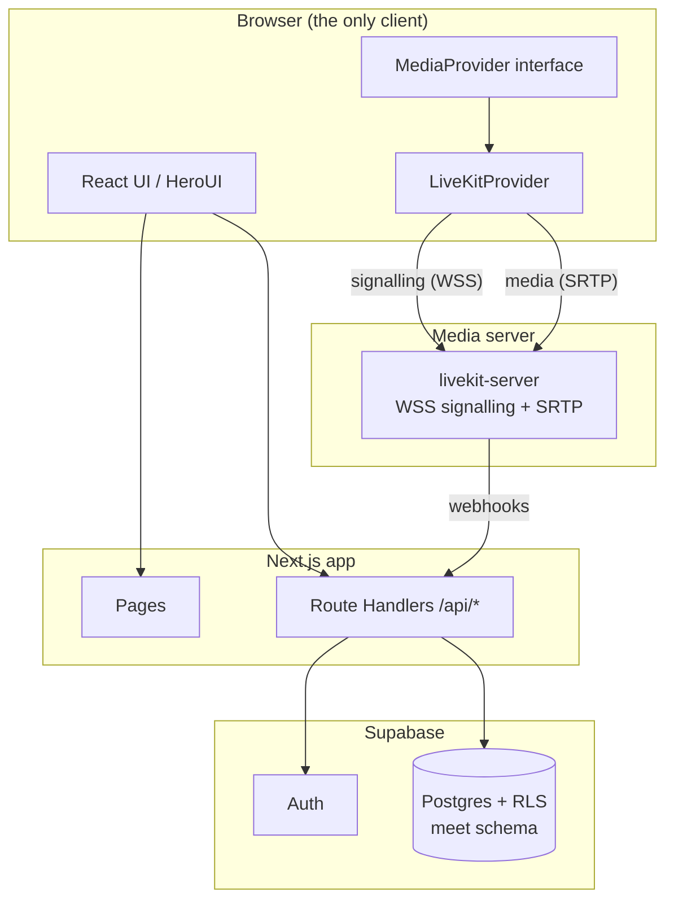

# Architecture

This document explains how OpenMeet is put together and why. If you plan to
contribute — or to swap out a major piece — start here.

## System overview



## Core design decisions

### 1. The browser never talks to Supabase directly

Every read and write goes through this app's `/api/*` routes, which use the
service role key server-side. The anon key is therefore also a *server-side*
value — that is why it is `SUPABASE_ANON_KEY` and not `NEXT_PUBLIC_…`.

Two payoffs:

- **Security** — the service role key never ships to a client, and `select`
  lists are explicit allowlists, so `password_hash` cannot leak by accident.
- **Reachability** — a participant's browser only ever contacts *your* domain.
  Networks where `*.supabase.co` is slow or blocked (notably mainland China)
  still work, and you keep control over the whole request path.

### 2. `MediaProvider` — all WebRTC lives behind one interface

`lib/media/types.ts` defines the contract. `livekit-client` may only be
imported under `lib/media/providers/livekit/`, enforced twice: an ESLint
`no-restricted-imports` rule and `scripts/check-china-safe.sh` in CI.

Pages, components, hooks and stores depend on the interface only. Replacing
LiveKit with another SFU means writing one new provider — no UI changes.

The interface has been extended three times (chat, background effects, prejoin
preview) using **interface declaration merging**, appended in clearly marked
blocks so the original contract stays readable and untouched. Follow that
pattern rather than editing earlier blocks.

### 3. Background effects are processed client-side, with self-hosted models

Blur and virtual backgrounds run in the participant's browser via
`@livekit/track-processors` (MediaPipe selfie segmentation). The server does no
video processing at all, so this feature costs nothing in server capacity.

**The assets are deliberately self-hosted.** The library defaults to loading
its wasm from jsdelivr and its model from `storage.googleapis.com`; both are
unreachable from mainland China, which would hang the feature indefinitely for
those users. `scripts/fetch-mediapipe-assets.sh` places them under
`public/mediapipe/`, and a regression test pins `assetPaths` to those local
paths so the CDN default cannot creep back in.

The processor library is loaded lazily — it is not in the initial bundle of any
route (there is a build-time check for this).

### 4. Capacity is guarded globally, and fails open

`MAX_CONCURRENT_PARTICIPANTS` caps total concurrent participants across all
rooms, checked when creating a room and when joining. Headcount comes from
LiveKit's live room list, falling back to a database count.

If **both** sources fail, the guard **allows** the request and logs loudly.
This is deliberate and the opposite of how the password throttle behaves: the
capacity ceiling is a quality-of-service protection, not a security boundary,
so a monitoring outage must not take the whole system down. Unit tests pin both
behaviours so neither drifts.

### 5. Rooms are durable; meetings are sessions

A `room` is a reusable entity with a stable join link. A `meeting` is one
sitting inside that room. "End meeting" closes the current sitting and
disconnects everyone, but the room stays usable for the next one; deleting a
room is a soft delete (`status='disabled'`) that hides it from the list while
keeping history intact.

Meeting creation is funnelled through a single path (`POST /join`) — webhooks
only ever *look up* meetings, never create them. This closes off a class of
duplicate-data bugs caused by webhook redelivery.

## Data model

Four tables in the `meet` schema (see `supabase/migrations/`):

| Table | Purpose |
|---|---|
| `rooms` | Durable room: code, title, bcrypt password hash, participant cap, expiry, owner |
| `meetings` | One sitting in a room; partial unique index guarantees at most one open meeting per room |
| `participants` | Everyone who joined a meeting, including anonymous guests |
| `meeting_sessions` | Audit trail: join / leave / quality telemetry |

RLS is enabled everywhere as defence in depth, and `anon`/`authenticated` are
granted nothing at all — normal access is service-role-only from the API layer.

## API surface

| Endpoint | Auth | Purpose |
|---|---|---|
| `POST/GET /api/rooms` | session | Create / list rooms |
| `GET/PATCH/DELETE /api/rooms/{id}` | owner | Detail / update / soft delete |
| `POST /api/rooms/{id}/end` | owner | End the current meeting |
| `POST /api/rooms/{id}/participants/mute[-all]` | owner | Server-enforced mute |
| `GET /api/rooms/{code}/meta` | public | Room state for the join page |
| `POST /api/rooms/{code}/join` | public | Validate, then issue a media token |
| `GET /api/capacity` | public | Current / max concurrent participants |
| `POST /api/webhooks/livekit` | signature | Participant + meeting auditing |
| `POST /api/telemetry/quality` | public | Client-reported RTT / loss / bitrate |

Ownership checks always fold "someone else's room" and "no such room" into the
same 404, so existence cannot be probed.

## Directory layout

```
app/                      # routes: pages + /api handlers (no src/ directory)
  api/                    # Route Handlers — the only place that touches the DB
components/
  join/                   # join entry + device pre-join
  room/                   # meeting room: grid, control bar, chat, panels
  dashboard/              # room management
lib/
  media/
    types.ts              # the MediaProvider contract (frozen; extend by merging)
    providers/livekit/    # the ONLY place allowed to import livekit-client
  server/                 # server-only logic: auth, policies, LiveKit admin
  store/                  # Zustand stores
  ui-text.ts              # ja/zh dictionary
supabase/migrations/      # ordered SQL migrations
tests/                    # Vitest — pure logic, no UI runtime needed
```

## Testing conventions

Business logic is extracted into pure, UI-free functions so it can be tested in
a plain Node environment; components stay thin. A few tests are *structural
guards* rather than behaviour tests — they assert things like "no opacity
animation on an element containing a `<video>`" or "background asset paths are
always same-origin". Those exist because the corresponding bugs were expensive
to find in production, and they are cheap insurance against regressions.

Test files must not import `lib/supabase.server.ts` (its `server-only` guard
throws outside a server runtime). Keep headless logic in separate modules.
